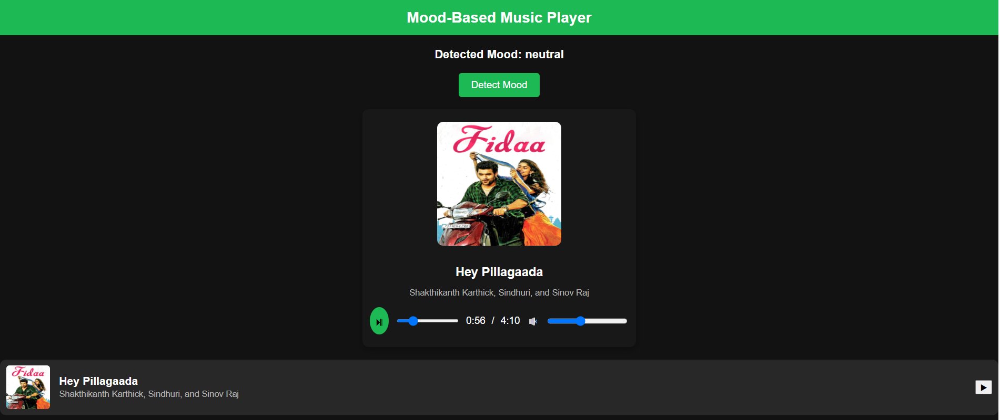

#  Mood-Based Music Player
A smart music player that detects your mood using real-time facial emotion recognition and plays songs accordingly.  
This project combines **Python (DeepFace + Flask)** for mood detection, **PHP + MySQL** for the backend song database, and **HTML/CSS/JavaScript** for the front end.

## Features

- Detects mood using your **webcam** and **DeepFace**.
- Dynamically fetches songs that match your mood from a **MySQL database**.
- Displays the currently playing song with thumbnail, title, and artist info.
- Includes audio controls like **play/pause**, **progress bar**, and **volume**.
- Clean, Spotify-like dark theme UI.

---

##  Tech Stack

| Component         | Technology Used                                      |
|-------------------|------------------------------------------------------|
| **Frontend**      | HTML, CSS, JavaScript                                |
| **Backend API**   | Python (Flask) + DeepFace                            |
| **Database**      | MySQL + PHP (to fetch songs based on mood)           |
| **Emotion AI**    | DeepFace(facial emotion detection)                   |
| **Media**         | Audio files (.mp3), Thumbnails (.jpg)                |

## Moods Supported
 - happy
 - sad
 - angry
 - neutral
 - fear
 - disgust
 - surprise

## Screenshot 
 
